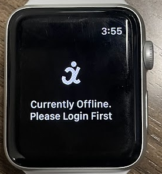

.. _bravoWearableApp:

BRAVO Wearable App Guides
=========================================

Overview
-----------------------------------------

The BRAVO Wearable App is a free tool that support various patient-oriented research study, specifically collection of kinetic data for 
objective symptom assessment in Movement Disorder patients. The App is currently available in iOS `App Store <https://apps.apple.com/us/app/bravo-wearable-app/id6448851156?platform=iphone>`_ for iPad and iPhones. 
The application is focusing on managing inertia sensor recordings collected using different wearable sensors.

The application is designed as a supplementary tool to the research-focused BRAVO Platform, and usage of the application is only approved upon consenting to research studies. 
If researchers intend to use this application to collect Apple's Movement Disorder Kit recordings or motion data available on the application, 
you must consent study participants for your study complying to your local institute's Institutional Review Board requirements. 
This application allows study participants who consented in various research studies to perform motion sensor data collection for weeks in between clinic visits. 
Data can be shared to researchers by users if they consent to the researchers' studies. These data will allow healthcare providers and researchers gaining additional insight about the study participants' 
symptoms in various treatment paradigms or other interventions comparisons. 

The application, as a companion app to the BRAVO Platform, contains other basic capabilities offered by the Web-version, such as for user to submit customized surveys 
or to visualize neuronal models that clinicians or researchers shared with the user. Users can use this application as a simple motion recording software to collect their 
own motion data using Apple Watches or MBIENTLAB sensor if they are enrolled in a research study that requested objective inertia sensor data. 
This application allows users to collect data without any PHI stored in the mobile device. There will not be data sharing from the app to 3rd party company. 
All data are managed and owned by the user until uploading or downloading to their phone storage. All data are available to the user without paywall, contracts, or marketing agreements.

**Permission Requested**:

1. *Wi-Fi* is required for account authentication. Local Network Access may be requested if your local BRAVO Database is hosted in Internal Network.
2. *Bluetooth* Low Energy is required for communication with MBIENTLAB sensors for wearable sensor data collection.
3. *Accelerometer* Permission is required to use the Apple Watch component for Apple's Movement Disorder Kit sensor collection
4. *HealthKit* Query is required for collecting Heart Rate, Heart Rate Variability, and Sleep State data.
5. *Internet* Connectivity is required for requesting Brain Models for visualization and submit customized Survey through mobile app.

Account Creation
-------------------------------------------

The BRAVO Wearable App can only be accessed after logging in, as required by Apple App Review due to Health-oriented research nature of the app. 
Therefore, the responsibility of consenting patient and creating account falls under every site's researchers who utilize the BRAVO Platform. 

Once a patient is consented, users may access :ref:`usage:Patient Overview` on BRAVO Platform for the specific consented patient, and access **Mobile App Manager**. 
New patient without previous mobile account generation would look like the following: 

Clicking on **Create** button will prompt user to create a new username and password for the patient to use the BRAVO Wearable App. 

Access Private BRAVO Database through Mobile App 
----------------------------------------------------

To use the account created, users must ensure to provide the consented patient with a public-facing URL for the BRAVO Platform. 
On the mobile app landing page, a WiFi-Hotpot Icon can be found at top-right corner of the page. Pressing on the icon will show the menu 
of either Public Server (Demo Server for BRAVO Platform) or Private Server (Custom Server URL). 

The private URL must contain HTTP or HTTPS protocol prefix, without trailing **/**. An example of a valid URL looks like `http://10.16.99.250:3001` or `https://bravo.publicdomain.com`. 
After providing the URL, a popup-message should notify the user that the mobile app is **Connected**. Then the patient may proceed to login. 

BRAVO Wearable App Primary Features
----------------------------------------------------

The BRAVO Wearable App currently offers 3 main features:

1. Wearable Sensor Controller
2. Survey (Event) Submission
3. 3D Image Visualization

Wearable Sensor Controller
~~~~~~~~~~~~~~~~~~~~~~~~~~~~~~~~~~~~~~~~~~~

The motion sensor controller is the primary interface that display available sensors detected by the App. Currently, **MBIENTLAB MMS+** and **Apple Watch (Series 3 or newer)** are supported. 
The app will automatically search for paired Apple Watches or nearby Bluetooth LE enabled MMS+ sensors. The search period is 5-second, and user may restart searching by pulling down the list (pull-refresh).

Apple Watch Controller
+++++++++++++++++++++++++++++++++++++++++++

Apple Watch controller offers simple interface that allow configuration of recording paradigm and retriving exisiting recordings on Apple Watches. 
The Apple Watch App is standalone application that enable recordings via a simple **Start Recording** button. The recording will run continuously 
until either 1) 12-hour has past or 2) user pressed **Stop Recording** button. Once pressed, the Watch will query all the recorded data in sequence and 
logged them in a customized data format. 

The Apple Watch app will record all recording-type by default, but this is configurable on the iOS App, where user can toggle recording-type to on/off. 
Once everything is configured, the Apple Watch can be carried and recorded without nearby iOS App. This is because the recording is completely offline
as a logging feature. This significantly extended the battery-life when compared to real-time streaming approach. The iOS App can store up to 24 days of continous recording on 
4GB space with all recording-type enabled. 

Survey Question Types
~~~~~~~~~~~~~~~~~~~~~~~~~~~~~~~~~~~~~~~~~~~

The Survey available in the mobile is identical to the Web-version (Refer to :ref:`Tutorials/TwilioService:Survey in BRAVO Platform`) with the following 3 question types supported. 

1. Basic Text Response 
2. Basic Multiple-Choice Response
3. Basic Slider (analog scale) Response

User submissions will be linked to the account that the mobile account is linked with. 

.. note::
  
  Currently, online visualization is not available as it is a function in development. 
  We aim to provide survey response similar to "Event" marked by users on their DBS device. 

3D Image Visualization
~~~~~~~~~~~~~~~~~~~~~~~~~~~~~~~~~~~~~~~~~~~

This is a complete port of the Web 3D Visualization using `Three.js <https://threejs.org/>`_ on React Native, the `Expo-Three <https://github.com/expo/expo-three>`_ module. 
Almost all source codes are direct copy/paste from online version, so please refer to :ref:`Tutorials/ImageRenderer:3D Image Visualization Toolkit` for more details.

