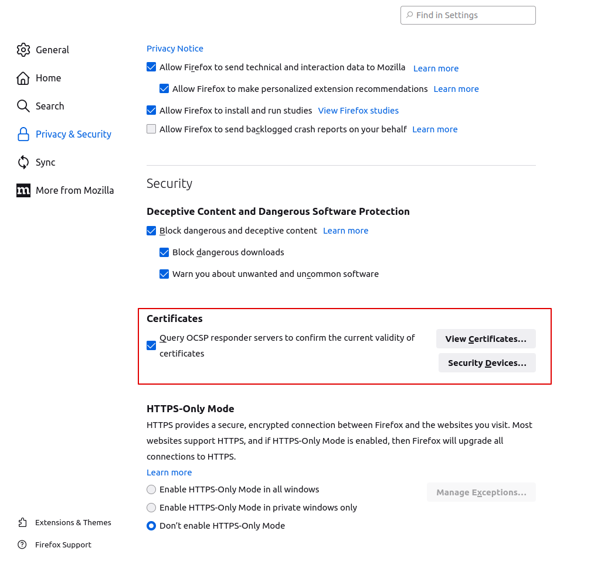
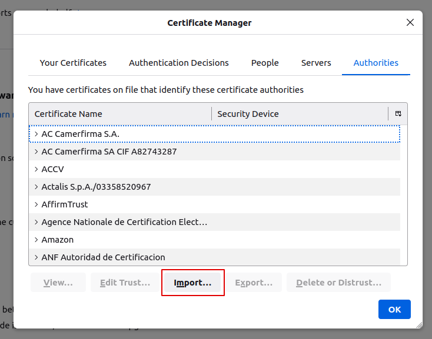
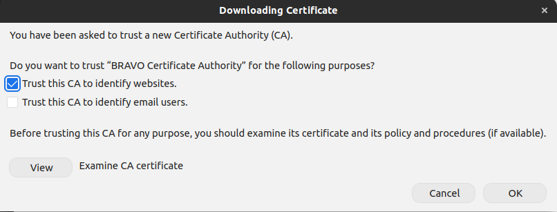
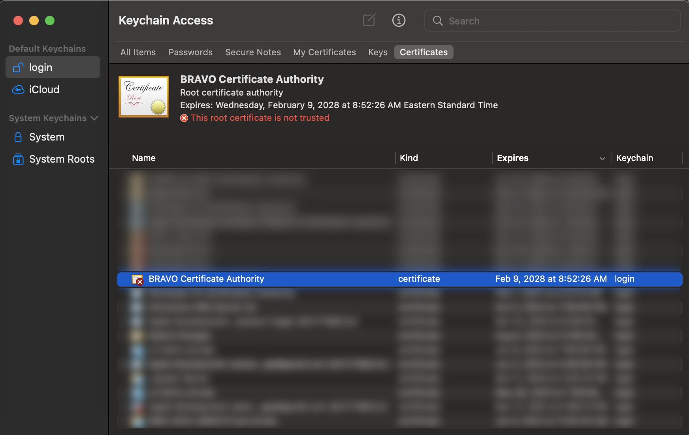
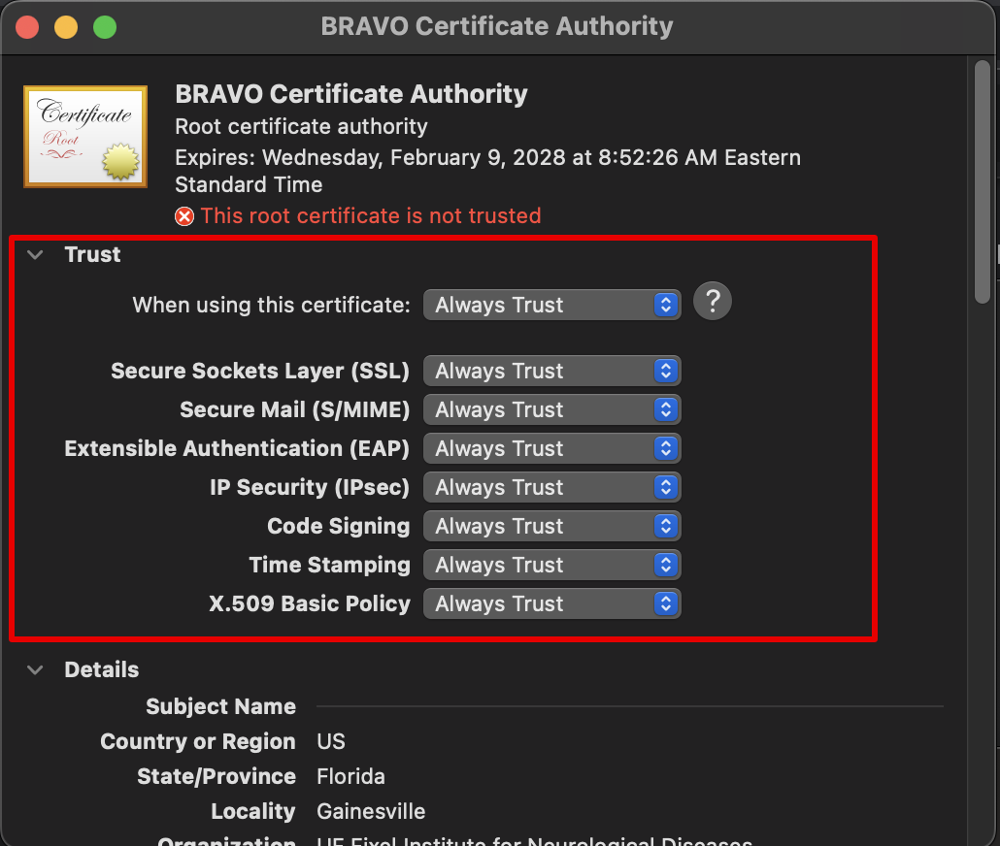

.. _SSLCertificateTutorial:

Secure BRAVO Server with SSL Certificate
=========================================

Overview
-----------------------------------------

The BRAVO Platform v2.0 onward implemented split Server/Client design. This allow the client to be deployed 
as a serverless static page, and the BRAVO Server can be hosted anywhere else. This is made so that if user 
does not want to modify frontend, they can directly use the existing BRAVO Platform static page without installing/building
with node package manager (NPM). 

The existing BRAVO Platform is currently hosted at `UF BRAVO Demo Page <https://uf-bravo.jcagle.solutions/index>`_. User 
may use ``Change Database Host`` option to alter current connected server. See :ref:`databaseModification` for detail usage instruction. 

Create Root Certificate and SSL Certificate (Linux)
----------------------------------------------------

To create SSL certificate and become your own Certificate Authority is to use ``openssl`` in Linux. 
You can install openssl with the following code: 

.. code-block:: bash

  sudo apt-get install openssl

Step 1: Create Certificate Authority
~~~~~~~~~~~~~~~~~~~~~~~~~~~~~~~~~~~~~~~~~~~~~~~~~~~~

To generate a secure key for your certificate, use the following command. Openssl will also prompt the user to 
enter a secure passphrase to encrypt the key with. Keep the passphrase safe for future. 

.. code-block:: bash

  openssl genrsa -des3 -out BRAVO_CA.key 2048

Then with the key, we can generate our Root Certificate (with a 10-year expiration time). You can adjust the days to 
your need. You will also be prompted to enter your passphrase for your key here to ensure you are the owner of the key. 

.. code-block:: bash

  openssl req -x509 -new -nodes -key BRAVO_CA.key -sha256 -days 3650 -out BRAVO_CA.pem

  # ------------------------------------------------------- 
  # The prompt will require you to enter the following information. 
  # These information will be shown in the root certificate
  # Here I show what UF BRAVO Platform Certificate uses, but you can write your own information.
  # -------------------------------------------------------
  #Country Name (2 letter code) [AU]: US
  #State or Province Name (full name) [Some-State]: Florida
  #Locality Name (eg, city) []: Gainesville
  #Organization Name (eg, company) [Internet Widgits Pty Ltd]: UF Fixel Institute for Neurological Diseases
  #Organizational Unit Name (eg, section) []: UF BRAVO Platform
  #Common Name (e.g. server FQDN or YOUR name) []: BRAVO Certificate Authority
  #Email Address []: .

Step 2: Create your BRAVO Server's SSL Certificate
~~~~~~~~~~~~~~~~~~~~~~~~~~~~~~~~~~~~~~~~~~~~~~~~~~~~

Now we can finally create your server's SSL certificate, signed by the Certificate Authority you created yourself. 
This certificate is going to be served by your reverse proxy server to enable HTTPS protocol. 

Instead of directly creating a self-signed SSL certificate, we have to generate a certificate-request. This ``csr`` file is 
being used to request your Certificate Authority to sign. 

.. code-block:: bash

  openssl genrsa -out bravo.server.key 2048
  openssl req -new -key bravo.server.key -out bravo.server.csr

  # ------------------------------------------------------- 
  # The prompt will require you to enter the following information, AGAIN
  # These information will be shown in the certificate of your site
  # Here I show what UF BRAVO Platform Certificate uses, but you can write your own information.
  # -------------------------------------------------------
  #Country Name (2 letter code) [AU]: US
  #State or Province Name (full name) [Some-State]: Florida
  #Locality Name (eg, city) []: Gainesville
  #Organization Name (eg, company) [Internet Widgits Pty Ltd]: UF Fixel Institute for Neurological Diseases
  #Organizational Unit Name (eg, section) []: UF BRAVO Platform
  #Common Name (e.g. server FQDN or YOUR name) []: BRAVO Server
  #Email Address []: .

Next, you have to generate a ``X509 v3 certification configuration`` file. This file will 
primarily appending the IP and DNS information to the SUbject Alternative Name (SAN) field in the certificate. 
This will associate your certificate with an IP or domain-name. Name this file as ``bravo.server.ext``.

Edit DNS.1's value to your domain name (if internal IP, you can put whatever you want here).
Edit IP.1's value to your IP address (this is your Internal IP address).

.. code-block:: text

  authorityKeyIdentifier=keyid,issuer
  basicConstraints=CA:FALSE
  keyUsage = digitalSignature, nonRepudiation, keyEncipherment, dataEncipherment
  subjectAltName = @alt_names

  [alt_names]
  DNS.1 = bravo.server
  IP.1 = 192.168.0.1

Now we finally can generate our certificate using openssl, and signed by our certificate authority. It will again prompt your for your 
Certificate Authority's passphrase to decrypt the key. 

.. code-block:: bash 

  openssl x509 -req -in bravo.server.csr -CA BRAVO_CA.pem -CAkey BRAVO_CA.key -CAcreateserial -out bravo.server.crt -days 365 -sha256 -extfile bravo.server.ext

Once this is done, you should see the following 3 files in your folder that is important for deployment: 

1. ``BRAVO_CA.pem`` Your Root Certificate 
2. ``bravo.server.crt`` BRAVO Server's Certificate 
3. ``bravo.server.key`` BRAVO Server's Certificate Key

Step 3: Deployment as SSL Site
~~~~~~~~~~~~~~~~~~~~~~~~~~~~~~~~~~~~~~~~~~~~~~~~~~~~

In this example I will describe deployment as SSL site through ``nginx``, a lightweight reverse proxy server that 
can be used to forward SSL requests. If you do not have **nginx** on your computer, you can install it with ``sudo apt-get install nginx``.

There is already a template configuration file in the BRAVO Repository, named ``deployment.conf``. ALthough it was written 
for public deployment with public DNS, we can adjust it slightly to be used with internal SSL deployment. 

The content of the file should look like the following:

.. code-block:: text
  :linenos:

  server {
    listen 443 ssl;
    server_name bravo-client.jcagle.solutions; 
    client_max_body_size 200M;

    ssl_certificate /etc/letsencrypt/live/bravo-server.jcagle.solutions/fullchain.pem;
    ssl_certificate_key /etc/letsencrypt/live/bravo-server.jcagle.solutions/privkey.pem;

    location / {
      proxy_redirect off;
      proxy_set_header host $host;
      proxy_set_header X-real-ip $remote_addr;
      proxy_set_header X-forward-for $proxy_add_x_forwarded_for;
      proxy_pass http://localhost:3001;
    }

    location /socket {
      proxy_pass http://localhost:3001;
      proxy_http_version 1.1;
      proxy_set_header Upgrade $http_upgrade;
      proxy_set_header Connection 'upgrade';
      proxy_set_header Host $host;
      proxy_set_header Origin $http_origin;
      proxy_cache_bypass $http_upgrade;
    }
  }

Delete line #3, you may delete the server_name line because you are using it as internal IP deployment. 

Modify line #6 to the full path of your certificate. For example: ``ssl_certificate /home/ubuntu/Certificate/bravo.server.crt;``.
Modify line #7 to the full path of your certificate key. For example: ``ssl_certificate_key /home/ubuntu/Certificate/bravo.server.key;``.

Modify line #4 if you think someone will upload a JSON file larger than 200 MB. 

Then you can copy the ``deployment.conf`` to your nginx's site-enable folder, typically in ``/etc/nginx/sites-enabled`` folder. 
Reload nginx by calling ``sudo systemctl restart nginx``. Now nginx server is restarted, any server hosting in your 3001 port 
will get reverse proxy from 443 HTTPS standard port. 

Step 4 (Optional): Turn BRAVO Server into System Service
~~~~~~~~~~~~~~~~~~~~~~~~~~~~~~~~~~~~~~~~~~~~~~~~~~~~~~~~~~

This step is completely optional, but if you would like to make sure BRAVO Server is always up-and-running when you restart computer.
You can create a ``systemd`` service for its deployment. This step of tutorial can be treated as a continuation of the 
Installation Guide for Linux. 

Create a text file called ``bravo.server.service`` with the following contents:

.. code-block:: text 
  :linenos:

  [Unit]
  After=network.target
  RestartLimitIntervalSec=0
  StartLimitBurst=100

  [Service]
  Type=simple
  User={USERNAME}
  WorkingDirectory={SCRIPT_DIR}/
  ExecStart={SCRIPT_DIR}/venv/bin/daphne -b 0.0.0.0 -p 3001 BRAVO.asgi:application
  Restart=always

  [Install]
  WantedBy=multi-user.target

Replace {SCRIPT_DIR} with the actual full path to your BRAVO Server directory. This is the same ``SCRIPT_DIR`` in :ref:`LinuxEnvirontmentSetup`
step. 

Place ``bravo.server.service`` to the directory ``/etc/systemd/system/``. 
Now you can simply start the service and enable it to be running at all time. 

.. code-block:: bash 

  sudo systemctl start bravo.server.service
  sudo systemctl enable bravo.server.service

Trust CA Certificate on Client PC
----------------------------------------------------

Since we are our own Certificate Authority, and we are not actually certified in global network, we have to ensure users 
who use the BRAVO Server trust us as certificate authority first. Otherwise, their computer will give security warning 
whenever they access your server (which is a good thing! Keep your users safe). 

Although it is easy to simply tell the browser to "ignore the warning and continue" in most modem browser, that is not
the safe solution, because they may accidentally approve a malicious page. The (slightly more) secure solution is to 
provde people who you think will access your server with your Root Certificate. This root certificate, is the ``BRAVO_CA.pem``
certificate you created during **Certificate Authority** step. 

Provide the ``BRAVO_CA.pem`` file to your users, and ask them to trust this Certificate Authority as legit issuer. This 
will automatically approve any site certificates signed by this Certificate Authority, including the ``bravo.server.crt`` you created 
for your server. 

Approve CA Certificate on Firefox (Ubuntu)
~~~~~~~~~~~~~~~~~~~~~~~~~~~~~~~~~~~~~~~~~~~~~~~~~~~

Firefox is the default browser in Ubuntu. You can view all your privacy setting of your Firefox Browser by opening a new tab
with the address of ``about:preferences#privacy``. After entering the **Privacy&Security** tab, scroll to the bottom and 
you can see the following configuration:

Click on ``View Certificates`` in the red box area, and you will open the Certificate Manager. 
Switch to the tab ``Authorities`` as shown below: 

Click on import, you will be prompted to select the certificate, now you can select the ``BRAVO_CA.pem`` certificate. 
Trust the certificate by checking the "Trust this CA to identify websites". Once this is done, you should be able to connect to the server
without issue. 

Approve CA Certificate on all browsers (MacOS)
~~~~~~~~~~~~~~~~~~~~~~~~~~~~~~~~~~~~~~~~~~~~~~~~~~~

MacOS certificate management is done by the system, which means all browser will utilize the same rules once trusted. 

User can bring up certificate manager by accessing ``Keychain Access`` application. Double clicking the ``BRAVO_CA.pem`` certificate
will automatically import the certificate in ``Keychain Access`` (shown below).

Now find the BRAVO Certificate Authority that you imported in the certificates tab. The name of the authority should be 
the name you type in for "Common Name" when prompted during CA creation process. Double clicking the certificate 
will bring up the trust setting, choose "Always Trust" when using this certificate. Once this is done, you should be able to connect to the server
without issue. 

