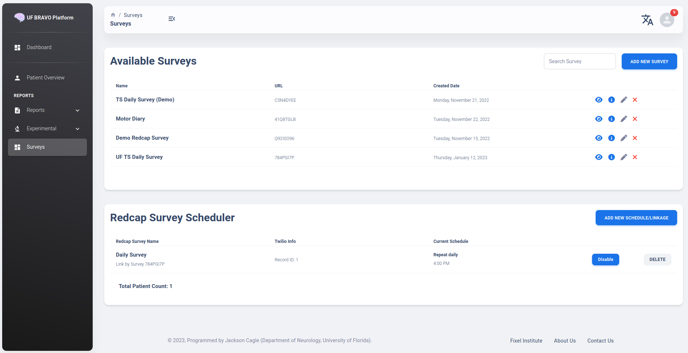
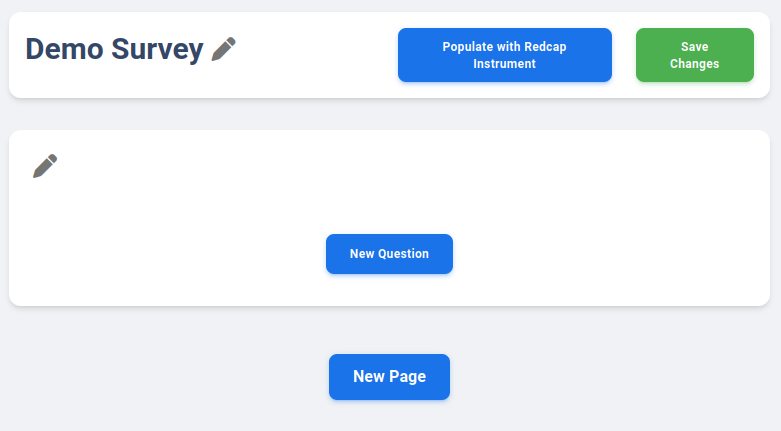
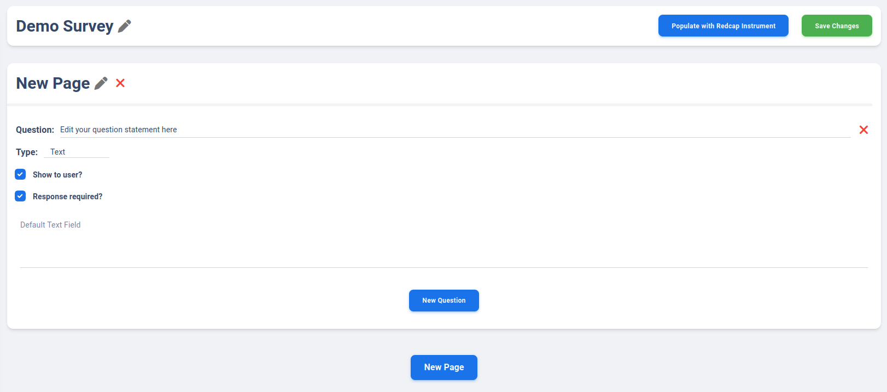
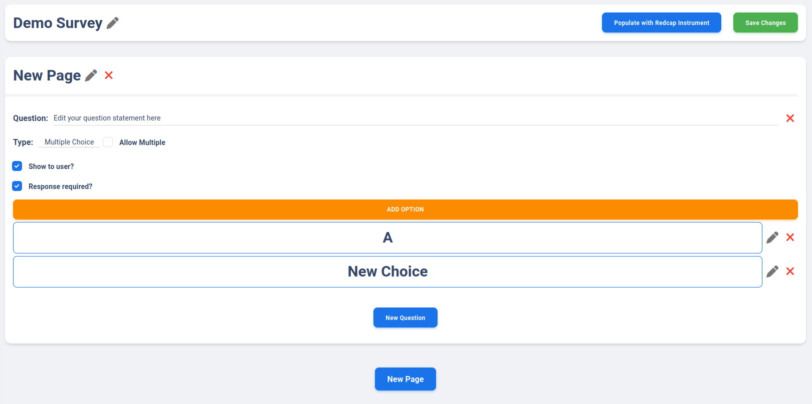
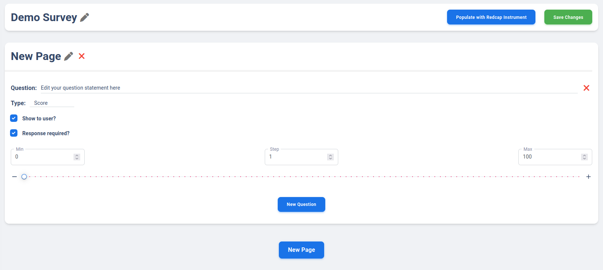
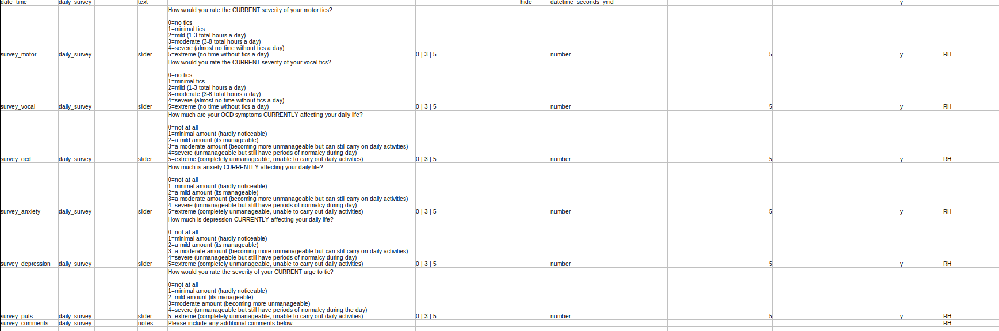
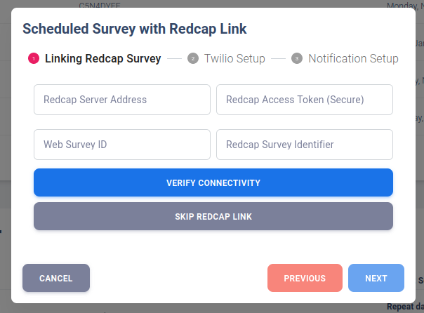
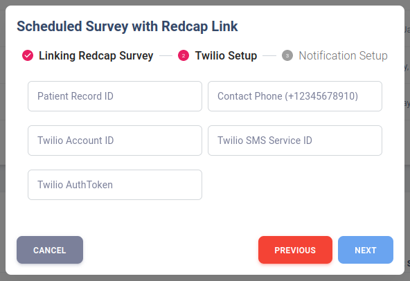
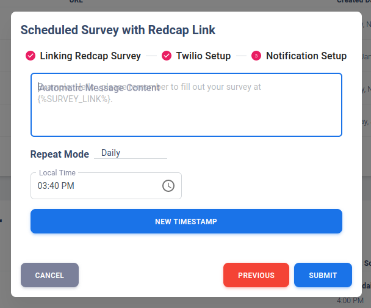

Twilio Scheduler Guide
=========================================

Overview
-----------------------------------------

Twilio is a text/email/WhatsApp messaging tool that serve as a great notification/survey delivery platform. 
It is a common tool to be combined with REDCap Database to deliver surveys to study participants.
This guide provide a general step-by-step overview of how Twilio is integrated with REDCap via the BRAVO Platform Survey system. 

Survey in BRAVO Platform
-------------------------------------------

Survey is one optional feature available on the BRAVO Platform, as shown in the navigation menu on the left of the platform. 
As shown in the following figure, the Survey Table present in a similar fashion as the patient table, where user may add Survey 
(stored uniquely on your own account, accessible by creator only). 

Create New Survey
~~~~~~~~~~~~~~~~~~~~~~~~~~~~~~~~~~~~~~~~~~~

User may create new survey simply by clicking on ``Add New Survey`` button in the table. Doing so will prompt user to enter
a name for the survey. After a new survey is created, you may click on the pen icon (Edit Survey) to view the survey editor. 

The survey editor is a simple interface as shown below. User may choose to add pages or add questiions to the current page. 
Page is defined as a section of questions that belong to the same view, and each page may contain multiple questions. 

Survey Question Types
~~~~~~~~~~~~~~~~~~~~~~~~~~~~~~~~~~~~~~~~~~~

Currently, three basic survey question types are available. User may choose which type the question will be by selecting from the dropdown menu.

1. Basic Text Response 
2. Basic Multiple-Choice Response
3. Basic Slider (analog scale) Response

The most basic survey option is a text question. User may write a question, and the response from the user is a free-response. 
There are currently no limit placed on the length. 

Multiple-choice question can have as many options as you want by adding options on your own. 
You may chooose to make multiple answers selectable or only a single option is selectable. 
In actual survey view, the options are shown in form of radio-button. In mobile view, 
the multiple choice is shown similar to editor view (large block-size button).

A simple slider question can be configured by selecting min/max and step size of the slider. This is useful for 
designing an analog scale. 

Common with all three question type is the ability to set if a question is shown to the user or not. 
This is commonly used for common placeholder question if user want to implement backend calculation. 
In addition, a question can be set as optional by toggling ``Response required?`` off. 

Red X-mark beside any options/questions/pages is used to delete the corresponding item. 

.. note::
  
  Currently no logic operation is implemented on the survey. Future update will allow selective question display based on user response. 

Populate with REDCap Instrument
~~~~~~~~~~~~~~~~~~~~~~~~~~~~~~~~~~~~~~~~~~~

REDCap Survey are designed in form of "Instrument". Each survey can be exported in CSV similar to the table below:

Basic survey can be automatically populated to be shown on the BRAVO Survey Platform. 
This is to create a public survey accessible outside of the private network that REDCap reside in. 
After populating the survey, you can click "Save Changes" to save all the content to server. 
This will also associate redcap instrument question_id with each respective question. This allow submitting 
survey record to REDCap server via Twilio Integration easier. 

.. note::
  
  Currently, validation is not being used to validate question. 
  In addition, only multiple-choice, slider, and text/description questions are parsed 
  because those are the only question type designed on the platform. 
  In the future, more types will be supported. 

Twilio Integration
-------------------------------------------

Twilio is currently integrated into BRAVO Platform as an additional plugin. 
The BRAVO platform is handling basic information storage and query once a Twilio setup is stored. 

REDCap Database API Integration
~~~~~~~~~~~~~~~~~~~~~~~~~~~~~~~~~~~~~~~~~~~

The primary usage of Twilio is to be linked with REDCap Database. 
REDCap database often comes with API access. User may request a API Token
from their REDCap Admin. This token allow association of project and user. 

.. topic:: REDCap Server Address

  REDCap Server Address is the API route available to the user. For example, University of Florida
  uses ``https://redcap.ctsi.ufl.edu/redcap/api/`` as their API Endpoint. 

.. topic:: REDCap Access Token

  This token associate you as an user to the project that you request from. 
  This token is unique for each project and each member of the project. 
  This is a secure token and do not share with others. You can request it directly from 
  REDCap Admins.

.. topic:: Web Survey ID

  This is the Web Survey URL (8-character string) on BRAVO platform Survey Page. For example, ``784PGI7P``.
  This survey should be populated with REDCap Instrument CSV, because each question on the survey 
  must be associable with each question on REDCap Instrument to allow one-to-one relationship.

.. topic:: REDCap Survey Identifier 

  This unique identifier for the REDCap Instrument (not the human readable name). This is to allow server 
  to identify which instrument to submit response to. 

If REDCap Integration is not needed for Twilio, you may skip this step as well. 

Twilio API Integration
~~~~~~~~~~~~~~~~~~~~~~~~~~~~~~~~~~~~~~~~~~~

Similar to REDCap Database API Integration, the BRAVO platform also need to store the tokens for Twilio APIs. 

.. topic:: Patient Record ID

  Unique Patient ID that this phone number is associate to. You can make this a random string or number. 
  However, if REDCap Linkage is established, you should set this to the same record_id as the patient record
  on REDCap Database. 

.. topic:: Contact Phone

  The number that the Twilio Service should message to. This needs to include country code. 
  This is your receiver's number.

.. topic:: Twilio Account ID, Twilio AuthToken, Twilio SMS Service ID

  All information are directly on Twilio account page. These information are important to allow Twilio API
  properly identify which account and what phone number to be used to transmit the message. 

.. topic:: Automatic Message Content

  The body of the text message content. This identical message will be sent to user at desired time. 
  Not much customization is available at the moment. Future modification may be available with logic 
  if receive enough requests. 

.. topic:: Message Frequency

  The message can be sent on a daily/weekly basis. Multiple timestamp is available within the same day
  or same week. 
  
