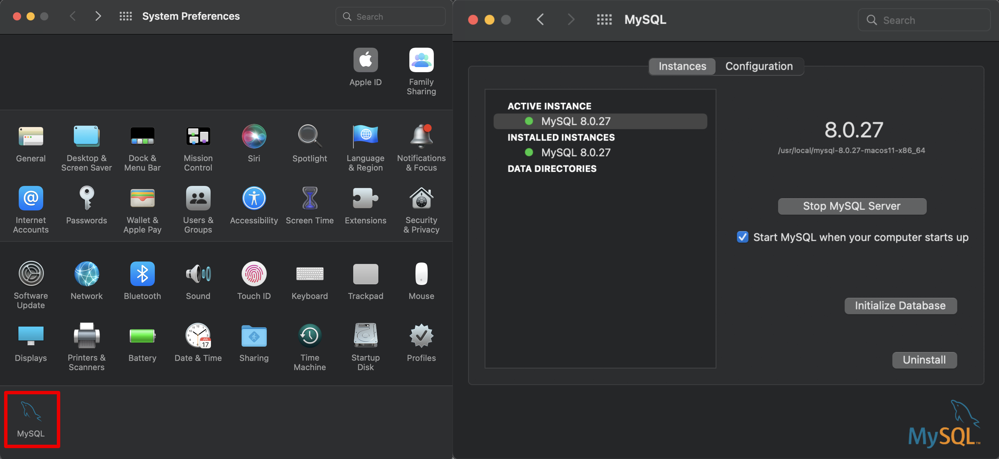
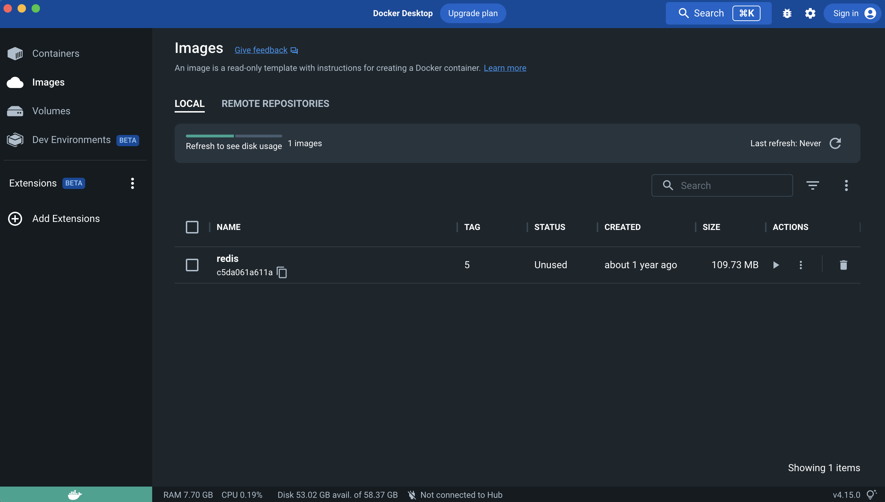

Installation Procedures
=============================================

The UF BRAVO Platform consist of 2 main components: *Python Server* and *React Frontend*. 
These two components can communicate through both Websocket and REST APIs, 
supported by `Django Channels <https://channels.readthedocs.io/en/stable/>`_ and 
`Django REST Framework <https://www.django-rest-framework.org/>`_. 

The documentation will walk through installation of both components; 
however, users may choose to use only one components without the other based on their need and customization.
A common example would be to use *Python Server ONLY* to process and organize session files but without a web interface. 
The users then can perform custom analysis pipeline using Python, MATLAB, or R on the structured Percept object. 

Dependencies
-----------------------------------------------

Software Packages
~~~~~~~~~~~~~~~~~~~~~~~~~~~~~~~~~~~~~~~~~~~~~~~

1. **Python** 3.70 or above 
2. **MySQL** Databse 
3. **Node Package Manager** 7 or above 

React Frontend
~~~~~~~~~~~~~~~~~~~~~~~~~~~~~~~~~~~~~~~~~~~~~~~

React Frontend dependencies will be listed in ``package.json`` in Client folder for simplified installation. 
Only the main packages will be shown below.

1. **React** (^18.2.0)
2. **React Router DOM** (^6.2.1)
3. **Plotly.js** (^2.14.0)
4. **Axios** (^0.27.2)
5. **Material User Interface Design** (^5.10.8)
6. **Math.js** (^11.2.1)
7. **React Three Fiber** (^8.8.8)

Python Server
~~~~~~~~~~~~~~~~~~~~~~~~~~~~~~~~~~~~~~~~~~~~~~~

Python Server dependencies will be listed in ``requirement.txt`` in Server folder for simplify installation.
Only the main packages will be shown below.

1. **Django** (Django==4.0.6)
2. **Django Channels** (channels==4.0.0)
3. **Django REST Framework** (djangorestframework==3.14.0)
4. **MySQL Client** (mysqlclient==2.1.1)
5. **Daphne** (daphne==3.0.2)
6. **Matplotlib** (matplotlib==3.5.2)
7. **Cryptography** (cryptography==37.0.4)
8. **NiBabel** (nibabel==4.0.2)
9. **Numpy** (numpy==1.23.1)
10. **Scipy** (scipy==1.9.0)
11. **Scikit Learning** (scikit_learn==1.1.3)
12. **Spectrum** (spectrum==0.8.1)
13. **Pandas** (pandas==1.4.3)
14. **Date Utilities** (python_dateutil==2.8.2 && pytz==2022.1)
15. **HTTP Requests** (requests==2.28.1)
16. **Twilio SMS Service SDK** (twilio==7.15.2)
   
.. note::
   The packages listed above contain developmental features and may not be 100% neccessary for the basic usage. 
   A trimmed version may be created in the future if some packages are not used anymore.

React Frontend Installation Guide
------------------------------------------------

The frontend webpage is written in React.js as a static standalone application. 
This means that the frontend webpage can be shared as a simple static folder without compilation. 
User may download pre-built application folder to host on their own server
or use `statically hosted webpage <https://uf-bravo.jcagle.solutions/>`_. 

Build from Source (NPM)
~~~~~~~~~~~~~~~~~~~~~~~~~~~~~~~~~~~~~~~~~~~~~~~

For user who want to modify the frontend webpage and create their own routes, the source code is available on
`Github Repo <https://github.com/Fixel-Institute/BRAVO>`_. 
You will need to use `NPM <https://www.npmjs.com/>`_ for installing dependencies and running build scripts. 

The minimum node version required is v16. You may use `Node Version Manager <https://github.com/nvm-sh/nvm>`_ to download the desire 
node version. 

Both NPM and NVM are easily accessible on Linux and MacOS. For Windows User, I recommend using Windows Subsystem for Linux (WSL) available
on Windows 10 and Windows 11. You can build the source code like below:

.. code-block:: bash

  # Change current working directory to BRAVO/Client
  cd BRAVO/Client
  
  # Install Dependencies with npm
  npm install

  # Hosting on 3000 port of your local computer 
  npm start

  # Building static webpage for hosting
  npm run build

If you are using the platform locally, you simply need to use ``npm start`` to start hosting the source code on your local computer.
This will also allow private network users accessing your webpage if they know your IP address and your 3000 port is open-accessed. 

The built binaries will be available in the **build** folder in the Frontend source folder. 
You can upload all content of the folder to your desire hosting platform 
(locally with NGINX or Apache2, or online hosting platform like AWS S3 or Cloudflare Pages)
if you want to make it statically available. However, putting them on public HTTPS page will require 
user to put their backend on either "localhost" or another publically available HTTPS endpoint for security issue. 

If you desire to host your webpage on private HTTP, you should ensure your frontend is also hosted on private HTTP host as well. 
If you do not wish to use Port 80 for http, you can simply use ``npm start`` to host your webpage and it will work just fine.

Python Server Installation Guide (Linux)
------------------------------------------------

The procedure described here are tested on Ubuntu 20.04 LTS with source file directly clone through GitHub. 
The procedure here are describing for both HTTP deployment (internal use only) and HTTPS deployment (public release). 

If you intend to deploy this software for public, I highly recommend using Linux deployment procedure for HTTPS. 
This tutorial will also cover for procedure to setup Amazon Web Service Elastic Cloud Compute (EC2) 
platform to work with Django Project. 

.. _LinuxEnvirontmentSetup:

Step 0: Environment Setup
~~~~~~~~~~~~~~~~~~~~~~~~~~~~~~~~~~~~~~~~~~~~~~~

Install dependencies packages using ``apt-get`` is the simpliest way to start. 
We will install MySQL and Python3 Virtual Environment to setup the conditions for server. 

It is also noted that the default Python distribution on Ubuntu 18.04 is Python 3.6, therefore not satisfying the requirement. 
You need to either manually update the Python distribution so that ``python3 --version`` is up-to-date or use Ubuntu 20.04 LTS, 
which comes with Python 3.8.

All procedure assume that your working directory is the main directory of the cloned Git folder (i.e.: ``/home/ubuntu/BRAVO/Server``).

.. code-block:: bash
  
  # Set our current working directory as the SCRIPT_DIR
  SCRIPT_DIR="$( cd -- "$( dirname -- "${BASH_SOURCE[0]}" )" &> /dev/null && pwd )"

  # Install Dependencies with Apt
  sudo apt-get update
  sudo apt-get install python3-pip libjpeg-dev libjpeg8-dev libpng-dev nginx python3-virtualenv libmysqlclient-dev mysql-server docker.io
  
  # Setup Redis Server on Docker for Django Channels
  sudo docker run -p 6379:6379 -d redis:5

  # Create Virutal Environment for Python called "venv"
  virtualenv $SCRIPT_DIR/venv
  source $SCRIPT_DIR/venv/bin/activate

  pip3 install -r requirements.txt

Step 1: SQL Databse Setup
~~~~~~~~~~~~~~~~~~~~~~~~~~~~~~~~~~~~~~~~~~~~~~~

SQL Database will be used to store account information, patient entries, device entries, 
and various recording information. Due to the data size, neural recordings are not directly stored in database, 
but instead stored locally in binary format at the DataStorage folder. A data pointer that associate local files 
with patient recording will be stored in database for ease-of-access.

SQL Database will require manual creation prior to main server installation unless an existing database is used. 
You can access MySQL Database (the default database used for the installation script, but other database can be used.) through the following scripts.

.. code-block:: bash

  sudo mysql -u root
  # this would prompt you to enter admin password here for superuser privilege.

  # Following commands are within mysql command-line-interface
  # Create database named "BRAVOServer"
  mysql> CREATE DATABASE BRAVOServer;

  # Create a user that can access the database called "BRAVOAdmin" with an admin password called "AdminPassword"
  # Change these values to what you see fit.
  mysql> CREATE USER 'BRAVOAdmin'@'localhost' IDENTIFIED WITH mysql_native_password BY 'AdminPassword';
  mysql> GRANT ALL PRIVILEGES ON BRAVOServer.* TO 'BRAVOAdmin'@'localhost';
  mysql> FLUSH PRIVILEGES;

  # exit MySQL Interface 
  mysql> exit

Once the account is set-up and database is created. You can edit the ``Server/mysql.config`` file to 
reflect actual accses credential for your database. 

Step 2: Server Environment Variables
~~~~~~~~~~~~~~~~~~~~~~~~~~~~~~~~~~~~~~~~~~~~~~~

Environment variable for Python server is saved as a JSON file named ``.env``. Python will load in the file content during load time.
An example environment file looks like the following. 

.. code-block:: json

  {
    "DATASERVER_PATH": "/home/ubuntu/DataStorage/",
    "PYTHON_UTILITY": "/home/ubuntu/BRAVO/Server/modules/python-scripts",
    "ENCRYPTION_KEY": "4LLHi6IJ0PRdneDJo48kCcBf3tHTLRXQ_tyKfttDIm0=",
    "SERVER_ADDRESS": "bravo-server.jcagle.solutions",
    "CLIENT_ADDRESS": "bravo-client.jcagle.solutions",
    "MODE": "DEBUG"
  }

.. topic:: DATASERVER_PATH

  Absolute path to the folder storing all non-SQL data (TimeSeries and others).
  You should have read/write or owner permission on the folder. 
  The folder should contain 3 subfolders for organization: ``cache``, ``sessions``, and ``recordings``.

.. topic:: PYTHON_UTILITY
  
  Absolute path to the folder containing Python Utility files. 
  This is a submodule path in Server folder, and it is also where you can put your custom Python scripts.

.. topic:: ENCRYPTION_KEY

  Fernet Cryptography, it is recommended to generate this string in Python using the following code.

.. code-block:: python
  
  from cryptography import fernet

  fernet.Fernet.generate_key().decode("utf-8")
  # Output: 'uCskkPv8pVyF9r0tSXQs2hvD7YYs-eS8nP7pkwz0vps='

.. topic:: SECRET_KEY

  This is a web-server specific key for cryptographic signing for session cookies.
  DO NOT let others get your key, otherwise they can modify cookies sent by our server.

.. topic:: SERVER_ADDRESS and CLIENT_ADDRESS

  The server address to access the Python Server. 
  This can be the same as your React Frontend address (CLIENT_ADDRESS) if you setup Proxy for it.
  If not, configure both string to the correct path.

.. topic:: MODE

  The Django operating mode. DEBUG allow more error log in case if an error is shown. 
  During development, you may keep it as ``DEBUG`` but set to ``PRODUCTION`` when done. 

Step 3: Django - MySQL Database Initialization
~~~~~~~~~~~~~~~~~~~~~~~~~~~~~~~~~~~~~~~~~~~~~~~

Initial migration is required to setup the Database to the required structure of Django Server. 
This only need to be run once, unless a change is made to ``Server/Backend/models.py`` file. 

.. code-block:: bash

  python3 $SCRIPT_DIR/manage.py makemigrations Backend
  python3 $SCRIPT_DIR/manage.py migrate

Step 4: SSL (HTTPS) Certificate (Optional)
~~~~~~~~~~~~~~~~~~~~~~~~~~~~~~~~~~~~~~~~~~~~~~~

This step is not neccessary for local deployment. However, for people who want additional security to deploy with HTTPS, 
we will provide guidance for obtaining simple certificates for SSH. 

The most common tool for free SSL certificate is through `CertBot <https://certbot.eff.org/>`_. 
Refer to CertBot site to install tool on your server computer. 
First, you can configure your DNS record to have your server address (``$YOUR_SERVER_ADDRESS``) point to your server IP. 
Then run the following script to obtain your SSL certificate. 
The output certificates should be saved in a directory at ``/etc/letsencrypt/live/$YOUR_SERVER_ADDRESS/``.

.. code-block:: bash 
  
  sudo certbot certonly --standalone --preferred-challenges http -d $YOUR_SERVER_ADDRESS

A bare-minimum sample nginx configuration file ``deployment.conf`` is in Server directory as a reference to create a working reverse proxy server to direct SSL traffic to your server.
This configuration file should be saved in ``/etc/nginx/sites-enabled/`` directory and you should reload your nginx service whenever a change is made to the configuration.

Step 5: Deployment
~~~~~~~~~~~~~~~~~~~~~~~~~~~~~~~~~~~~~~~~~~~~~~~

Due to the use of Websocket for real-time analysis, the default operating condition is through 
Asynchronized Server Gateway Interface (ASGI) as opposed to the default Web Server Gateway Interface (WSGI) for Python. 
To use ASGI, we use ``daphne`` to start our server. A standard startup script ``startServer.sh`` is available in Server folder for reference.

.. code-block:: bash 

  #/bin/bash
  SCRIPT_DIR=$( cd -- "$( dirname -- "${BASH_SOURCE[0]}" )" &> /dev/null && pwd )

  # To start with WSGI - Django Channels Disabled
  $SCRIPT_DIR/venv/bin/python3 $SCRIPT_DIR/manage.py runserver 0:3001
  
  # To start with ASGI - Django Channels Enabled. 
  $SCRIPT_DIR/venv/bin/daphne -p 3001 -b 0.0.0.0 BRAVO.asgi:application

.. warning:: 

  Due to how daphne is looking for Python modules, the working directory must be in "Server" folder for the command to work. 

A more advanced SSL Certificate and Automatic Background Service tutorial can be found at :ref:`SSLCertificateTutorial` tutorial page. 

Python Server Installation Guide (Windows)
------------------------------------------------

The Windows Deployment for BRAVO 2.0 will be different from the original BRAVO_SSR Windows Deployment. 
The original BRAVO_SSR deplyoment for Windows focus on making Django working with Windows-specific MySQL Database and Apache Server. 
However, we decide to move toward making things easier by using the Windows Subsystem for Linux (WSL). 

Using WSL, the deployment is essentially identical to Linux procedure with a few modifications. However, these procedure are not 
recommended for production purposes. I still recommend actual Linux Server as the production server host. However, Windows can still 
be used as developmental server to test capabilities. 

Step 0: Environment Setup
~~~~~~~~~~~~~~~~~~~~~~~~~~~~~~~~~~~~~~~~~~~~~~~

WSL can be enabled on Windows computer running Windows 10 Anniversary Update or newer builds. 
A good tutorial for WSL can be found at `Microsoft Learning page <https://learn.microsoft.com/en-us/windows/wsl/install>`_. 

In additional to WSL, we will also be using `Visual Studio Code <https://code.visualstudio.com/>`_ as our primary development environment. 
VS Code has a useful plugins that enable direct development in WSL. A `tutorial on installing WSL plugins <https://code.visualstudio.com/docs/remote/wsl>`_ 
is available. With this plugin, you can run build scripts directly on WSL. For our tutorial, we will be installing WSL Version 2, to have maximum compatibility with 
Docker for Windows. 

A third dependencies is Docker. ``docker.io`` package is available on WSL but Docker operates better with Desktop Application tunnel through WSL 2.  
You may download Docker Desktop for Windows through their `docker tutorial <https://docs.docker.com/desktop/install/windows-install/>`_. 

The rest of the installation procedure is assumed for you to be in WSL environment using VS Code integration with WSL. 

Install dependencies packages using ``apt-get`` is the simpliest way to start. 
We will install MySQL and Python3 Virtual Environment to setup the conditions for server. 

It is also noted that the default Python distribution on Ubuntu 18.04 is Python 3.6, therefore not satisfying the requirement. 
You need to either manually update the Python distribution so that ``python3 --version`` is up-to-date or use Ubuntu 20.04 LTS, 
which comes with Python 3.8 or Ubuntu 22.04 LTS which comes with Python 3.10. 

All procedure assume that your working directory is the main directory of the cloned Git folder (i.e.: ``/mnt/d/GitHub/BRAVO``).

.. code-block:: bash
  
  # Set our current working directory as the SCRIPT_DIR
  SCRIPT_DIR="$( cd -- "$( dirname -- "${BASH_SOURCE[0]}" )" &> /dev/null && pwd )"

  # Install Dependencies with Apt
  sudo apt-get update
  sudo apt-get install python3-pip libjpeg-dev libjpeg8-dev libpng-dev python3-virtualenv libmysqlclient-dev mysql-server 

  # Create Virutal Environment for Python called "venv"
  virtualenv $SCRIPT_DIR/venv
  source $SCRIPT_DIR/venv/bin/activate

  pip3 install -r requirements.txt

Step 1: SQL Databse Setup
~~~~~~~~~~~~~~~~~~~~~~~~~~~~~~~~~~~~~~~~~~~~~~~

SQL Database will be used to store account information, patient entries, device entries, 
and various recording information. Due to the data size, neural recordings are not directly stored in database, 
but instead stored locally in binary format at the DataStorage folder. A data pointer that associate local files 
with patient recording will be stored in database for ease-of-access.

SQL Database will require manual creation prior to main server installation unless an existing database is used. 
You can access MySQL Database (the default database used for the installation script, but other database can be used.) through the following scripts.

It is also important to note that WSL does not have ``systemd`` for automatic background service startup. 
To start MySQL server, you should call ``sudo service mysql start`` manually to activate mysql service. 

.. code-block:: bash

  # Start MySQL if not started yet
  sudo service mysql start
  # this would prompt you to enter admin password here for superuser privilege.

  sudo mysql -u root

  # Following commands are within mysql command-line-interface
  # Create database named "BRAVOServer"
  mysql> CREATE DATABASE BRAVOServer;

  # Create a user that can access the database called "BRAVOAdmin" with an admin password called "AdminPassword"
  # Change these values to what you see fit.
  mysql> CREATE USER 'BRAVOAdmin'@'localhost' IDENTIFIED WITH mysql_native_password BY 'AdminPassword';
  mysql> GRANT ALL PRIVILEGES ON BRAVOServer.* TO 'BRAVOAdmin'@'localhost';
  mysql> FLUSH PRIVILEGES;

  # exit MySQL Interface 
  mysql> exit

Once the account is set-up and database is created. You can edit the ``Server/mysql.config`` file to 
reflect actual accses credential for your database. 

.. note:: 

  Given how WSL handles permission. If your folder is cloned on your ``/mnt`` drive, you must modify the file's permission on Windows end to allow it 
  to be read by Django. After you finish editing the config file, you must disable inheritance of permission from parent object. Then you remove all user
  permission, leave only ``Authenticated User`` group with Read and Read/Execute Access only (not even write access). This will avoid 
  [World Writable] permission error.

Step 2: Server Environment Variables
~~~~~~~~~~~~~~~~~~~~~~~~~~~~~~~~~~~~~~~~~~~~~~~

Environment variable for Python server is saved as a JSON file named ``.env``. Python will load in the file content during load time.
An example environment file looks like the following. 

.. code-block:: json

  {
    "DATASERVER_PATH": "/home/ubuntu/DataStorage/",
    "PYTHON_UTILITY": "/home/ubuntu/BRAVO/Server/modules/python-scripts",
    "ENCRYPTION_KEY": "4LLHi6IJ0PRdneDJo48kCcBf3tHTLRXQ_tyKfttDIm0=",
    "SERVER_ADDRESS": "bravo-server.jcagle.solutions",
    "CLIENT_ADDRESS": "bravo-client.jcagle.solutions",
    "MODE": "DEBUG"
  }

.. topic:: DATASERVER_PATH

  Absolute path to the folder storing all non-SQL data (TimeSeries and others).
  You should have read/write or owner permission on the folder. 
  The folder should contain 3 subfolders for organization: ``cache``, ``sessions``, and ``recordings``.

.. topic:: PYTHON_UTILITY
  
  Absolute path to the folder containing Python Utility files. 
  This is a submodule path in Server folder, and it is also where you can put your custom Python scripts.

.. topic:: ENCRYPTION_KEY

  Fernet Cryptography, it is recommended to generate this string in Python using the following code.

.. code-block:: python
  
  from cryptography import fernet

  fernet.Fernet.generate_key().decode("utf-8")
  # Output: 'uCskkPv8pVyF9r0tSXQs2hvD7YYs-eS8nP7pkwz0vps='

.. topic:: SECRET_KEY

  This is a web-server specific key for cryptographic signing for session cookies.
  DO NOT let others get your key, otherwise they can modify cookies sent by our server.

.. topic:: SERVER_ADDRESS and CLIENT_ADDRESS

  The server address to access the Python Server. 
  This can be the same as your React Frontend address (CLIENT_ADDRESS) if you setup Proxy for it.
  If not, configure both string to the correct path.

.. topic:: MODE

  The Django operating mode. DEBUG allow more error log in case if an error is shown. 
  During development, you may keep it as ``DEBUG`` but set to ``PRODUCTION`` when done. 

Step 3: Django - MySQL Database Initialization
~~~~~~~~~~~~~~~~~~~~~~~~~~~~~~~~~~~~~~~~~~~~~~~

Initial migration is required to setup the Database to the required structure of Django Server. 
This only need to be run once, unless a change is made to ``Server/Backend/models.py`` file. 

.. note::

  It is still not clear to me why WSL require us to have ``sudo`` privilege to access mysql socket. However, 
  if you do not have superuser privilege, you may encounter ``ERROR 2002 (HY000): Can't connect to local MySQL server through socket '/var/run/mysqld/mysqld.sock' (2)``
  error even though you can verify that MySQL is up and running. 

.. code-block:: bash

  sudo $SCRIPT_DIR/venv/bin/python3 $SCRIPT_DIR/manage.py makemigrations Backend
  sudo $SCRIPT_DIR/venv/bin/python3 $SCRIPT_DIR/manage.py migrate

Step 4: Deployment
~~~~~~~~~~~~~~~~~~~~~~~~~~~~~~~~~~~~~~~~~~~~~~~

Deployment in Windows can be done primarily through VS Code integrated with WSL. 
Once you open BRAVO Folder through WSL, you may observe the following indication that you are in WSL environment.

We have created a sample ``.vscode/tasks.json`` file that describe standard deployment scripts for you. 
Go to ``Terminal`` -> ``Run Task`` in VS Code and you will see ``BRAVO Server`` deployment configuration. Running it will 
bring up WSL Terminal, which will run the following pipeline to start BRAVO Server. You may modify paths and variables in ``.vscode/tasks.json``
for your needs. 

.. code-block:: bash

  cd ${cwd}/Server; 
  sudo /etc/init.d/mysql start; 
  sudo ${cwd}/Server/venv/bin/daphne -p 3001 -b 0.0.0.0 BRAVO.asgi:application

Python Server Installation Guide (MacOS)
------------------------------------------------

Installation of Python Server on MacOS follows the same process as Linux operating system. However, 
due to the lack of ``apt-get``, MacOS user must download neccessary dependencies manually. 

Step 0: Environment Setup
~~~~~~~~~~~~~~~~~~~~~~~~~~~~~~~~~~~~~~~~~~~~~~~

We will need to install MySQL, Docker with Redis, and Python3 Virtual Environment to setup the conditions for server. 
If you do not have Python3 on your Mac, you should download that via `official Python Page <https://python.org/downloads>`_. 

You can setup MySQL on Mac using `MySQL Community Server <https://dev.mysql.com/downloads/mysql>`_. Once downloaded and installed,
check ``System Preferences`` on MacOS and you should see a new option is now available at the bottom of the page, called "**MySQL**".
Click on MySQL to ensure that it is currently active. You can turn off/on the server manually or to set MySQL to start when computer startup.

You will also need docker and redis for Django Channels. 
You can install docker for MacOS using `Docker Desktop <https://docs.docker.com/desktop/install/mac-install/>`_.
Once installed, you can open Docker in your Application folder and confirm it is running. 
To install Redis, you can call ``docker pull redis`` in MacOS Terminal. 
Confirm redis is installed by checking "Images" in Docker Desktop. 
 

You now have all the software requirement (except Apache/NGINX, which will not be covered here 
because I do not recommend using MacOS for hosting public application). The following script go over the rest of the dependencies
installation for Python3 using Virtual Environment. 

All procedure assume that your working directory is the main directory of the cloned Git folder 
(i.e.: ``/Users/Username/Documents/Github/BRAVO/Server``).

.. code-block:: bash

  # Set our current working directory as the SCRIPT_DIR
  SCRIPT_DIR="$( cd -- "$( dirname -- "${BASH_SOURCE[0]}" )" &> /dev/null && pwd )"

  # Setup Redis Server on Docker for Django Channels
  docker run -p 6379:6379 -d redis:5
  
  # Create Virutal Environment for Python called "venv"
  virtualenv $SCRIPT_DIR/venv
  source $SCRIPT_DIR/venv/bin/activate

  pip3 install -r requirements.txt
  
Step 1: SQL Databse Setup
~~~~~~~~~~~~~~~~~~~~~~~~~~~~~~~~~~~~~~~~~~~~~~~

SQL Database will be used to store account information, patient entries, device entries, 
and various recording information. Due to the data size, neural recordings are not directly stored in database, 
but instead stored locally in binary format at the DataStorage folder. A data pointer that associate local files 
with patient recording will be stored in database for ease-of-access.

SQL Database will require manual creation prior to main server installation unless an existing database is used. 
You can access MySQL Database (the default database used for the installation script, but other database can be used.) 

.. code-block:: bash

  sudo mysql -u root
  # this would prompt you to enter admin password here for superuser privilege.

  # Following commands are within mysql command-line-interface
  # Create database named "BRAVOServer"
  mysql> CREATE DATABASE BRAVOServer;

  # Create a user that can access the database called "BRAVOAdmin" with an admin password called "AdminPassword"
  # Change these values to what you see fit.
  mysql> CREATE USER 'BRAVOAdmin'@'localhost' IDENTIFIED WITH mysql_native_password BY 'AdminPassword';
  mysql> GRANT ALL PRIVILEGES ON PerceptServer.* TO 'BRAVOAdmin'@'localhost';
  mysql> FLUSH PRIVILEGES;

  # exit MySQL Interface 
  mysql> exit

Once the account is set-up and database is created. You can edit the ``Server/mysql.config`` file to 
reflect actual accses credential for your database. 

Step 2: Server Environment Variables
~~~~~~~~~~~~~~~~~~~~~~~~~~~~~~~~~~~~~~~~~~~~~~~

Environment variable for Python server is saved as a JSON file named ``.env``. Python will load in the file content during load time.
An example environment file looks like the following. 

.. code-block:: json

  {
    "DATASERVER_PATH": "/home/ubuntu/DataStorage/",
    "PYTHON_UTILITY": "/home/ubuntu/BRAVO/Server/modules/python-scripts",
    "ENCRYPTION_KEY": "4LLHi6IJ0PRdneDJo48kCcBf3tHTLRXQ_tyKfttDIm0=",
    "SERVER_ADDRESS": "bravo-server.jcagle.solutions",
    "CLIENT_ADDRESS": "bravo-client.jcagle.solutions",
    "MODE": "DEBUG"
  }

.. topic:: DATASERVER_PATH

  Absolute path to the folder storing all non-SQL data (TimeSeries and others).
  You should have read/write or owner permission on the folder. 
  The folder should contain 3 subfolders for organization: ``cache``, ``sessions``, and ``recordings``.

.. topic:: PYTHON_UTILITY
  
  Absolute path to the folder containing Python Utility files. 
  This is a submodule path in Server folder, and it is also where you can put your custom Python scripts.

.. topic:: ENCRYPTION_KEY

  Fernet Cryptography, it is recommended to generate this string in Python using the following code.

.. code-block:: python
  
  from cryptography import fernet

  fernet.Fernet.generate_key().decode("utf-8")
  # Output: 'uCskkPv8pVyF9r0tSXQs2hvD7YYs-eS8nP7pkwz0vps='

.. topic:: SECRET_KEY

  This is a web-server specific key for cryptographic signing for session cookies.
  DO NOT let others get your key, otherwise they can modify cookies sent by our server.

.. topic:: SERVER_ADDRESS and CLIENT_ADDRESS

  The server address to access the Python Server. 
  This can be the same as your React Frontend address (CLIENT_ADDRESS) if you setup Proxy for it.
  If not, configure both string to the correct path.

.. topic:: MODE

  The Django operating mode. DEBUG allow more error log in case if an error is shown. 
  During development, you may keep it as ``DEBUG`` but set to ``PRODUCTION`` when done. 

Step 3: Django - MySQL Database Initialization
~~~~~~~~~~~~~~~~~~~~~~~~~~~~~~~~~~~~~~~~~~~~~~~

Initial migration is required to setup the Database to the required structure of Django Server. 
This only need to be run once, unless a change is made to ``Server/Backend/models.py`` file. 

.. code-block:: bash

  python3 $SCRIPT_DIR/manage.py makemigrations Backend
  python3 $SCRIPT_DIR/manage.py migrate

.. warning:: 
  
  The new BRAVO Server Database has significant difference when compared to the original BRAVO platform v0.1 released in 2021.
  The database are not convertable at the moment, but a migration script is in development to help as much migration as possible. 

Step 4: Deployment
~~~~~~~~~~~~~~~~~~~~~~~~~~~~~~~~~~~~~~~~~~~~~~~

Due to the use of Websocket for real-time analysis, the default operating condition is through 
Asynchronized Server Gateway Interface (ASGI) as opposed to the default Web Server Gateway Interface (WSGI) for Python. 
To use ASGI, we use ``daphne`` to start our server. A standard startup script ``startServer.sh`` is available in Server folder for reference.

.. code-block:: bash 

  #/bin/bash
  SCRIPT_DIR=$( cd -- "$( dirname -- "${BASH_SOURCE[0]}" )" &> /dev/null && pwd )

  # To start with WSGI - Django Channels Disabled
  #$SCRIPT_DIR/venv/bin/python3 $SCRIPT_DIR/manage.py runserver 0:3001
  
  # To start with ASGI - Django Channels Enabled. 
  $SCRIPT_DIR/venv/bin/daphne -p 3001 -b 0.0.0.0 BRAVO.asgi:application

.. warning:: 

  Due to how daphne is looking for Python modules, the working directory must be in "Server" folder for the command to work. 

.. danger::

  If you encounter an error that shows ``NameError: name '_mysql' is not defined``. You are using a MacOS version that
  doesn't handle MySQL Client properly. The easiest solution is a post provided by Adan Johnson on 
  `How to use PyMySQL with Django <https://adamj.eu/tech/2020/02/04/how-to-use-pymysql-with-django/>`_. 

  To summarize, you should install PyMySQL ``pip3 install PyMySQL`` and edit `Server/BRAVO/setting.py` in the following manner.

  .. code-block:: python

    # Find this code block
    DATABASES = {
        'default': {
            'ENGINE': 'django.db.backends.mysql',
            'OPTIONS': {
                'read_default_file': os.path.join(BASE_DIR, 'mysql.config'),
                'init_command': "SET sql_mode='STRICT_TRANS_TABLES'"
            },
        }
    }

    # Add the following 3 lines right below it
    import pymysql
    pymysql.version_info = (1, 4, 2, "final", 0)
    pymysql.install_as_MySQLdb()