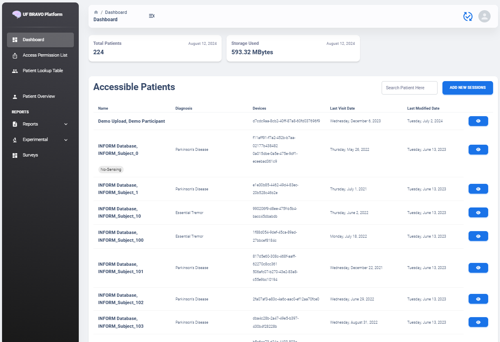
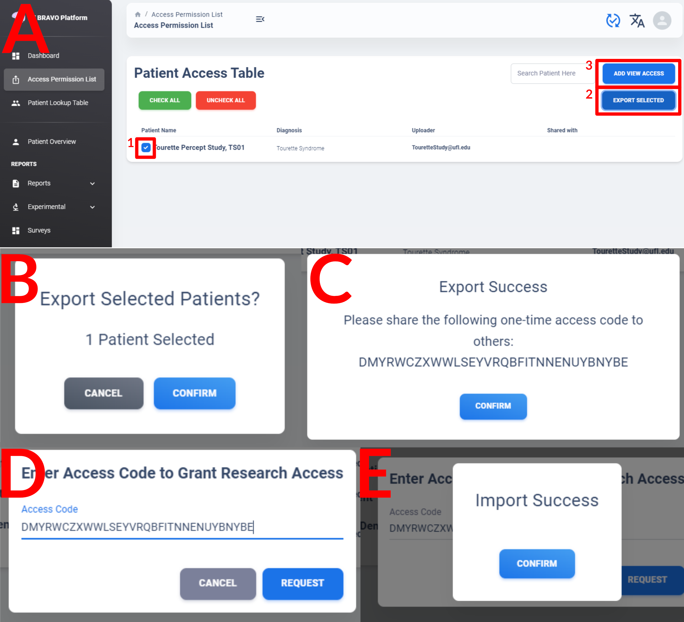
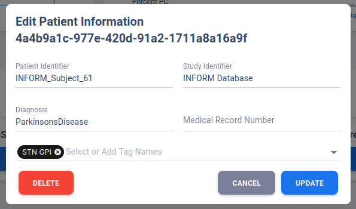
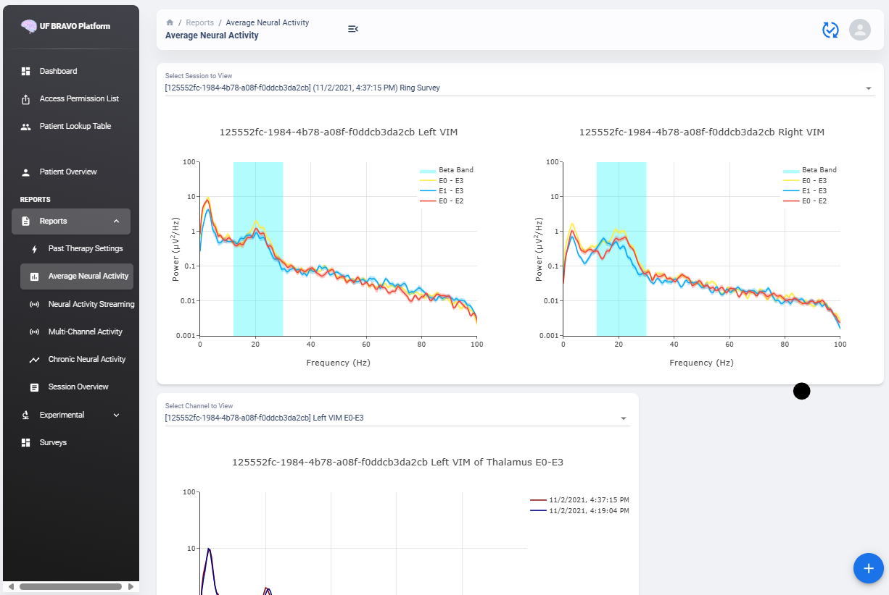

Usage Documentation
=============================================

The Usage Documentation will provide basic overview on functionality supported by UF BRAVO Platform frontend. 
UF BRAVO Platform is a Python-based Web Application designed to process and analyze third party medical device data. 
This documentation is intended to provide detail explainations on all functions currently available to the users.

The website you are viewing is a demo version designed for reviewers. 
The demo version contain only "Research" account and deidentified IDs will be used in place of patient identifiers. 
Despite only deidentification IDs are shown, the platform will still retain the data in cloud database to 
demonstrate the capability of long-term data aggregation. It is up to the user to ensure that any data uploaded 
will comply with their institutes' requirement for deidentification. 

.. _databaseModification:

Database Modification
---------------------------------------------

The client page is serverless static page, with all data retrieved from the server via simple REST API requests. 
The BRAVO Server can be hosted anywhere, including your local PC or internal IP. 

The standard port for locally hosted BRAVO Server is usually 3001 by default. Choosing ``localhost:3001`` will attempt to communicate with 
your server currently running on your PC. 
The Demo Server is hosted on Amazon Web Server and is only being used to demo platform capabilities. 

The ``Customized Server Endpoint`` option will bring up a text-form dialog to allow user to enter their own server (either publically accessible 
or internal network). If you are using the personally hosted HTTP deployment of the frontend, then the Network Endpoint 
can be HTTP as well. However, if you are using the publically available `UF BRAVO Demo Page <https://uf-bravo.jcagle.solutions/index>`_,
the endpoint has to be SSL secured. Check :ref:`SSLCertificateTutorial` for how to make your own server SSL certificate. 

Language Modification
---------------------------------------------

The BRAVO Platform uses React library for creating dynamic single page website. This means that all items on screen 
are dynamically generated, including text. See :ref:`languageDocumentation` for how you can edit the translation dictionary.

Authentication 
---------------------------------------------

Account authentication is done purely on the Python Server. 
In this section, I will describe the primary workflow for account registration and authentication. 

Account Registration
~~~~~~~~~~~~~~~~~~~~~~~~~~~~~~~~~~~~~~~~~~~~~

Account Registration interface can be seen below.

.. image:: images/Register.png
  :target: _images/Register.png
  :width: 400

A basic registration process that require the user to input their first and last name. 
The email address provided by the user will also be used as the Sign In credential (Username). 
All passwords are hashed before storage to ensure securtiy.

Account registered by the user will always default to "Research" account, 
which will remove patient identifications before display in any part of the webpage. 
Promotion of a "Research" account to "Clinician" account can be performed by Admin 
(the local admin at your institute that setup the platform). 
Clinician account will gain access to not only the patient identifiers, 
but also access to all data uploaded by other "Clinician" account within the same institute. 
On contrary, "Research" account's upload will not be added to the "Clinician" account 
nor any other "Research" account, everything will be specific to your account.

As a demo web application, no verification will be used on the registration email. 
Feel free to use made-up email address to register. 
In addition, no "Clinician" nor "Admin" accounts are created for the demo application. 

Account Sign-In
~~~~~~~~~~~~~~~~~~~~~~~~~~~~~~~~~~~~~~~~~~~~~

A user can sign in to their account through the Sign-In interface as shown below. 
Your credential will be stored as a simple JSON Web Token that will be used for authentication for every query to the server. 
The default timeout of the token is 4 hours. 

If you enable "Remember me" option, the token requested from the server will have extremely long expiration 
and require user to manually log out from the account when they are done. This should only be used in local server.

Patient Table  
---------------------------------------------

Patient Table is the first interface available to the user once logged in. 
A typical patient table containing more than 200 patients is shown below.

The clinician view will display patient's name, diagnosis, device name, 
and last accessed session file for each patient. A search bar is available to user (top right of the table). 
Filterable keywords include 1) Name, 2) Diagnosis, and 3) Device Name. 

The Patient Table column header is clickable and allow user to sort table by column. Most commonly used is "Last Modified Date" which indicate 
the last day a session related to that patient is uploaded. 

.. admonition:: Development
  
  The Patient Table also contains tagging system, where user may assign tags to each study participants in `Edit Patient Information`_ page. 
  The tags will also be used for filtering.

In a de-identified "Researcher" account view, fields are mostly leave as blank if user didn't provide any information. 
It is up to the researcher to properly label each deidentified patient to avoid confusion. 
Details on how to create a deidentified patient will be discussed in Reference `Upload Deidentified Patient`_ section. 
Details on how to edit an existing patient's information will be discussed in Patient Overview section.

.. _Upload Deidentified Patient:

Upload Deidentified Patient (Research Account)
~~~~~~~~~~~~~~~~~~~~~~~~~~~~~~~~~~~~~~~~~~~~~~~

User may put in ``Patient Identifier`` and ``Study Identifier`` to better differentiate patients for future references. 
Diagnosis and deidentifiered device name can be left as blank. Once all set, drop or add files to the upload box. 
All files in the upload box will be associated with the specific deidentified patient created. 

Once clicking ``Upload``, a new row will be insert to the deidentified patient table. 
If this patient has multiple device, follow instruction in Upload JSON Files (Research Only) to add new devices or additional JSON files. 

User may also opt to use the Batch Upload option with identified JSON file. 
The server will deidentify all identified file based on a simple encrypted lookup table upload by the user. 

.. image:: images/BatchDeidentificationUpload.png
  :target: _images/BatchDeidentificationUpload.png
  :width: 400

More details on the encrypted lookup table can be found in `Patient Lookup Table`_ section. 

Upload Identified Patient (Clinician Account)
~~~~~~~~~~~~~~~~~~~~~~~~~~~~~~~~~~~~~~~~~~~~~~~

In the clinician account view, the patient table will be shown with identifiers. 
Within clinician view, we eliminate the process to manually create patient from the table. 
In contrast, all information are automatically populated when user uploads identified JSON files 
exported from third party medical device.

The primary health information extracted are based on 1) Patient First and Last Name, 
and 2) Device Serial Number. Data aggregation is based primarily on Device Serial Number, 
and Patient Identifiers are used to determine if multiple devices belong to the same patient or not. 

Patient Lookup Table
---------------------------------------------

The Patient Lookup Table tab is a route only available on "Researcher Account". 
By the default, the page will only tell user if there is an existing Lookup Table on the server for your account or not.

If a table does not exist or you wish to update the table, you can use the "Add Table Here" option, which will bring up the 
upload dialog like below: 

In the upload dialog, you must enter a secure passcode for your lookup table because your lookup table will contain PHI. 
To ensure maximum security. your passkey will not be stored on the server and if you lost your passkey, your lookup table 
will be permenantly unusable. In such event, if you have the original table, you may choose to upload it again and overwrite the previous table. 

The minimum length of the passcode must be 4-character long. 

The lookup table must follow a standard CSV formatting, with the following require columns: 

1. patient_deidentifier, which will be used as Patient ID (FirstName) for deidentification 
2. study_deidentifier, which will be used as Study ID (LastName) for deidentification
3. identifier, which is the PHI composed of patient {First Name} {Last Name} {MRN} as recorded in the device. 
4. tags, which will be used to insert initial tags for the patient generated (Unavailable at the moment). 

Each patient_deidentifier and study_deidentifier combo may have multiple different identifier if the patient's name changed or that
different devices have different information stored. This identifier will be independent of the actual device ID. 

Once the table is uploaded, you can view the uploaded table using "Decrypt Table Here" option, which will attempt to parse the 
table using a password you provided. Error will be returned if password is incorrect. The viewing option is a once-only occurance and 
user must reenter the password when the page is refreshed. 

Deidentified View-Only Access (Beta Testing)
---------------------------------------------

A user may share one or more of their uploaded patient to others in deidentified form using the "Access Permission List" function on left of the navigation menu. 

Check the patient ID corresponding to the patient you want to share with others (Figure A.1) and then click **Export Selected** to bring up the confirmation window (Figure B). 
Once confirmed, a one-time access code is generated by the server with 1-hour expiration time. Share the random string with others. The receiving user should log into their 
account on BRAVO Platform connecting to the same server endpoint as the one who created share-link, then click on **Add View Access** (Figure A.3) to paste the access code. 
If access code is added successfully, the user can navigate back to Dashboard and observe a new patient added to their "Accessible Patients" list as "Deidentified XXXXX-XXXX-XXXX", where the blanked out 
string is the deidentified ID of the patient they have access to.

The view-only access granted by this process allow them to view data or export data, but cannot add new data nor modify information currently on the server. This is also a one-time permission, meaning that 
new data added to the patient by the original owner may not showed up to others who have view-access, unless the original owner repeat the sharing process. 

The sharing can be revoked by the original user if they remove the other's access from "Access Permission List". 

Patient Overview 
---------------------------------------------

Patient Overview is detailed interface when a patient is selected from the Patient Table. 
It describes brief information regarding the patient, and the devices currently associated with the specific patient. 
It also serves as the primary navigation to different analysis provided by the platform.

In the device information table, all previous devices associated with the patient will be shown in a table. 
Implant date and estimated battery life may not be accurate in Research Account view if removed as PHI. 
Electrode name and targets are information stored in Device, which will be downloaded along with the JSON file. 
These information will be automatically populated as long as they are not removed from JSON file.

.. image:: images/PatientOverview.png
  :target: _images/PatientOverview.png
  :width: 800

.. admonition:: Future Updates

  Device Type only support Medtronic Activa SC, PC, RC or Percept PC device in Research View. 
  Additional supported devices will be included as we obtained more data.

Edit Patient Information
~~~~~~~~~~~~~~~~~~~~~~~~~~~~~~~~~~~~~~~~~~~~~~~

User can edit the patient information through ``Edit Patient Information`` in Patient Overview Page. 
A pop-up dialog will be shown to user with existing patient information. Edit the desire fields 
then click ``UPDATE`` will prompt a database update.

Clicking ``DELETE`` will remove all data associated with this patient ID. 

Edit Device Information
~~~~~~~~~~~~~~~~~~~~~~~~~~~~~~~~~~~~~~~~~~~~~~~

User can edit the device information through ``pen`` icon corresponding to each device in Device Table of Patient Overview Page. 
A pop-up dialog will be shown to user with existing patient information. Edit the desire fields 
then click ``UPDATE`` will prompt a database update.

.. _Upload JSON Files:

Upload JSON Data (Research-Only)
~~~~~~~~~~~~~~~~~~~~~~~~~~~~~~~~~~~~~~~~~~~~~~~~~~~~~~~~~~~~~~~

"Upload New Sessions" is where the Research account should upload their data. 
Unlike Clinician account, the Research account is assumed to be working with deidentified files. 
That means the PHI used to group uploaded JSON into respective Patient ID or Device ID will not be present 
in the uploaded JSON files. This additional process required by the Research account ensure we can properly 
manage the data and organize them in correct group. 

After initial deidentified patient creation in Dashboard, the patient overview will be shown 
without any associated device. The user may manually add a device via "New Device" in "Device to Upload To" dropdown menu.
The user then can upload one or more files associate with that device. It is recommended to change device name after it is done by using the 
"Pen" icon on the right side of Device Table. 

If a patient is using bilateral neurostimulator, the user should create a second "New Device" and upload files separately. 

Primary Analysis Navigations 
~~~~~~~~~~~~~~~~~~~~~~~~~~~~~~~~~~~~~~~~~~~~~~~~~~~~~~~~~~~~~~~

.. list-table:: 
  :widths: 30 70
  :header-rows: 1

  * - Analysis Type
    - Analysis Description
  * - `Therapy History`_
    - Stimulation configurations in all past sessions, and detailed therapy group change trend. 
  * - `Average_Neural_Activity`_
    - Aggregated Average Neural Activities recorded during each session. 
  * - `Neural Activity Streaming`_
    - Realtime Streaming performed during each session. 
  * - `MultiChannel Activity`_
    - Another form of Realtime Streaming, based on simultaneous multi-channel streaming without stimulation. 
  * - `Chronic Neural Activity`_
    - Aggregated Power recording recorded chronically when patient is using recording-enabled therapy group.  
  * - `Session Overview`_
    - All Session JSON files uploaded to this patient. Also where EMR document can be generated. 
      
.. _Therapy History:

Therapy History View 
---------------------------------------------

Therapy History provide user an overview of all the past therapy configurations use by the user. 
These information are primarily extracted from ``GroupHistory`` and ``Groups`` JSON Fields in the Session file. 

Therapy Change Log
~~~~~~~~~~~~~~~~~~~~~~~~~~~~~~~~~~~~~~~~~~~~~~~~~~~~~~~~~~~~~~~

Therapy Change Log is a trend generated from third party medical device Session file's ``DiagnosticData.EventLogs`` JSON Field. 
A typical Therapy Change Log looks somewhat like the following code snipet: 

.. code-block:: json

  {
    "DateTime": "2021-10-25T22:35:01Z",
    "ParameterTrendId": "ParameterTrendIdDef.ActiveGroup",
    "NewGroupId": "GroupIdDef.GROUP_B",
    "OldGroupId": "GroupIdDef.GROUP_D"
  }

The datetime field indicate the time of group changes, based on UTC timezone and not patient's local timezone. 
In our platform, all time are presented as the user's local timezone. 

Past Therapy Configuration
~~~~~~~~~~~~~~~~~~~~~~~~~~~~~~~~~~~~~~~~~~~~~~~~~~~~~~~~~~~~~~~

The therapy configuration extracted from GroupHistory typically contains all information about the stimulation. 
For example, in above figure we present a typical therapy configurations for a patient before their session on December 6th, 2021. 
If you want to view post-session settings, you can toggle the selection to **Post-visit Therapy** to enable display.

The therapy information is displayed in 5 columns: 

  1. Group Name (and Usage percent since last available session)
  2. Therapy active contacts 
  3. Therapy configurations 
  4. Recording Configurations
  5. Cycling Stimulation configurations

When cursor hover over Therapy Active Contacts for a sensight lead, the individual contact amplitude for segmented electrode will 
be display as a tooltip. However, the individual segment amplitude is information stored only in Pre-visit Therapy and Post-visit Therapy. 

.. warning::

  Recording may show 0.0Hz as sensing frequency in **Past Therapy** tab
  because GroupHistory doesn't always maintain good storage of the Frequency. 
  It is typically accurate in Pre-visit Therapy and Post-visit Therapy tab. 

Electrode Impedance Heatmap
~~~~~~~~~~~~~~~~~~~~~~~~~~~~~~~~~~~~~~~~~~~~~~~~~~~~~~~~~~~~~~~

Below the therapy configuration table is the most recent Impedance recorded in the Session file. User may toggle between Bipolar Impedance and Monopolar Impedance. 
Hovering over the heatmap will show the exact impedance value. 

Clicking on the heatmap corresponding to the contact-pair of interest will bring up a small figure indicating the Impedance History over time as recorded in the aggregated history. 

.. _Average_Neural_Activity:

Average Neural Activity View 
---------------------------------------------

Average Neural Activity are a form of neural signal recording performed by third party medical device. 
It is stored in the Session JSON file as ``LfpMontageTimeDomain`` JSON Field. 
Each recording contains about 20 seconds time-domain recording recorded at 250Hz sampling rate. 

Average Neural Activity are snapshots of neural activity at the time of recording. 
We aggregated the Surveys collected over the span of patient's visit at the institute to inform 
changes of brain signal at the target brain region as desease progress (or as therapy delivered).

Power Spectrum across Channels
~~~~~~~~~~~~~~~~~~~~~~~~~~~~~~~~~~~~~~~~~~~~~~~~~~~~~~~~~~~~~~~

Power Spectrum are calculated with Welch's Periodogram method. 
The Session JSON files divide one survey into multiple simultaneous recordings of different channels. 
We organize them by performing clustering of timestamp. Recordings perform close to each other are shown side by side for comparison.

The survey displays are interactive and user may selectively choose channels to display or zoom and hover.
A dropdown menu is shown at the top of the page. All surveys are sorted by time.
The user may choose which Survey group to view. Left and right hemisphere are shown in different figure. 
Different channels are colored differently. 

Power Spectrum across Time
~~~~~~~~~~~~~~~~~~~~~~~~~~~~~~~~~~~~~~~~~~~~~~~~~~~~~~~~~~~~~~~

Average neural activity across time is an analysis perform across time, displayed at the bottom of the webpage.
It present all surveys recorded on the same channel organized by order of acquisition, colored by gradient of colormap. 
A dropdown menu is presented at top-right of the figure block. User may choose which channel to view.

This allow user to visually identify disappearance and emergence of certain brain signals. 
For example, in figure below we can see that an changes in recorded signal between July to October 2021. 

.. image:: images/PSDAcrossTime.png
  :target: _images/PSDAcrossTime.png
  :width: 400

.. _Neural Activity Streaming:

Neural Activity Streaming View 
---------------------------------------------

Neural Activity Streaming is one of the most detailed analysis provided by the platform. 
Neural Activity Streaming describe the neural recording collected during the real-time streaming of neural signal 
during therapy setup. Neural Activity Streaming allow simultaneous bilateral recording if both hemisphere are configured, 
but only one channel at a time. In addition, only Sensing-friendly configuration (E00-E02, E01-E03, E00-E03) are allowed 
to minimize effect of stimulation artifacts. Often time, users may start Neural Activity Streaming and adjust stimulation 
parameters to see effect of stimulation on the brain signal.

For multi-channel recordings without stimulation, user may refer to `MultiChannel Activity`_ section.

Select Recording to View
~~~~~~~~~~~~~~~~~~~~~~~~~~~~~~~~~~~~~~~~~~~~~~~~~~~~~~~~~~~~~~~

Similar to average neural activity page, Neural Activity Streaming data are aggregated for all patients. 
Recordings are organized by date of collection. The platform will also attempt to merge simultaneous 
Left/Right hemisphere recordings into one recording if detected. An example of the selection table is shown in above figures.

If recording contain both Left and Right hemisphere, the table will display information for both in one single row. 
The table provide essential information regarding the recording, such as recording duration and therapy configurations. 

.. note:: 

  The only information require manual update is Stimulation Mode (Ring Stimulation vs Segmented A, B, C) 
  because Session file does not store those information in the recording data. 

Neural Recording Summary
~~~~~~~~~~~~~~~~~~~~~~~~~~~~~~~~~~~~~~~~~~~~~~~~~~~~~~~~~~~~~~~

Once a user selected "View" in Selection Table, data will be processed in the server and transmitted 
to the web application for display. The display for a typical bilateral recording in shown in below figure. 
All figures provided in the graph are interactive with x-axis alignment fixed. 
All time are presented based on user's local timezone. Screenshot taken from Version 1.0 but overall capability has not changed in 2.0.

Time alignemnt with bilataral recording can be easily identified via Red Box 3 in below figure. 
The presence of pathological beta activity is supressed unilaterally when unilateral stimulation is 
turned on for Left and Right separately. The alignment shows that the stimulation artifact align with changes 
in stimulation parameters. 

User may choose to export the raw data. 
The export will generate a CSV file easily loaded in any scientific programming languages. 
The data are aligned if left and right hemisphere both present in the recording. 
Timestamp are provided as UTC timestamp in seconds. 
Aligned stimulation values are provided for identification of stimulation period. 

The basic summary uses default short-time Fourier Transform (Spectrogram) method to generate Time-Frequency Analysis. 
However, user can also choose to use Wavelet Transformation (usually more time-consuming). 
Once method is changed, the processed data are cached on the server and available to user in the future. 

Similarly, user may also choose to use a template matching cardiac filter to remove cardiac artifacts if present. 
below figures show the performance of the cardiac filter. 
It selectively remove signal without altering stimulation artifact spikes. 

.. image:: images/StreamingCardiacOFF.png
  :target: _images/StreamingCardiacOFF.png
  :width: 800

Effect of Stimulation
~~~~~~~~~~~~~~~~~~~~~~~~~~~~~~~~~~~~~~~~~~~~~~~~~~~~~~~~~~~~~~~

In the effect of stimulation presentation, the platform will automatically segment period with different 
level of stimulation and calculate average power spectrum for different stimulation amplitudes. 
The segments are sorted with increasing amplitude and color gradient indicate a changes of brain signal with 
increasing Stimulation.

User may toggle the Stimulation Reference to self or others, to use stimulation label from another electrode as the reference for segmenting. 

.. _MultiChannel Activity:

Multi-Channel Activity View 
---------------------------------------------

Multi-Channel Activity is similar to Neural Activity Streaming, but it doesn't come with stimulation parameters nor other labels. 
In exchange for that, the device allows simultaneous recording up to 6 channels at the same time (Bilateral E00-E02, E01-E03, 
and E00-E03). We align all recordings collected at the same time and perform quick time-frequency analysis display to the user.

The recording selection is performed through toggle buttons. 
Each button indicate the time and duration of the recording. After recordings are selected, 
user can retrieve the data from server, and simple display will be used to allow interactive 
visualization of Indefinite Streaming data.

The toggle selection actually allow multiple selection. User can select multiple recording from the same day 
and visualize them on the same time-axis. Segment without data will be leave as blank.

Since there are no extra label provided by neurostimulator. User may use external label such as biosensors or 
questionaires to indicate events. Data can be exported similar to Neural Activity Streaming. 

.. _Chronic Neural Activity:

Chronic Neural Activity View
---------------------------------------------

Chronic LFP records specific spectral power every 10 minutes when the patient is using a therapy group with 
recording capability enabled. LFPs are collected in a manner similar to the example structure below in ``DiagnosticData.LFPTrendLogs`` 
field. The LFP Trend Log divides recording into Left/Right hemisphere, and groups arrays of samples by date. 
Each sample contains a timestamp, a LFP measurment (integer, arbituary unit), and instananeous stimulation amplitude measurement. 

.. image:: images/ChronicLFP.png
  :target: _images/ChronicLFP.png
  :width: 800

.. note::

  It is important to note that ``DiagnosticData.LFPTrendLogs`` doesn't contain any important therapeutic information 
  beside amplitude. The most significant difficulty in interpreting the result is actually assigning proper therapy 
  information to each sample collected. 

.. code-block:: json

  "LFPTrendLogs": {
      "HemisphereLocationDef.Right": {
        "2022-01-11T13:51:24Z": [
          {
            "DateTime": "2022-01-11T16:11:44Z",
            "LFP": 1179,
            "AmplitudeInMilliAmps": 2.5
          },
        ],
      }
    }

In addition to the power sample collected every 10 minutes, there is also another similar Chronic neural 
recording capability available that capture brain signal every time a patient trigger a recording. This is known 
as the Patient Event Power Spectral Density (PSD). The available patient events are stored in ``PatientEvents`` structure. 
The recorded patient events are stored in ``DiagnosticData.LfpFrequencySnapshotEvents`` structure similar to shown below. 

.. code-block::

  "LfpFrequencySnapshotEvents": [
    ...,
    {
      "DateTime": "2021-02-17T19:37:16Z",
      "EventID": 1,
      "EventName": "Dyskinesia",
      "LFP": true,
      "Cycling": false
    },
    {
      "DateTime": "2021-02-18T14:35:23Z",
      "EventID": 4,
      "EventName": "Tremor",
      "LFP": false,
      "Cycling": false
    },
    ...,
    {
      "DateTime": "2021-06-10T19:41:58Z",
      "EventID": 1,
      "EventName": "Dyskinesia",
      "LFP": true,
      "Cycling": false,
      "LfpFrequencySnapshotEvents": {
      "HemisphereLocationDef.Right": {
        "DateTime": "2021-06-10T19:42:28Z",
        "GroupId": "GroupIdDef.GROUP_C",
        "SenseID": "",
        "FFTBinData": [...],
        "Frequency": [...],
      },
      "HemisphereLocationDef.Left": {...}
    },
  ]

Circadian Rhythms
~~~~~~~~~~~~~~~~~~~~~~~~~~~~~~~~~~~~~~~~~~~~~~~~~~~~~~~~~~~~~~~

Circadian Rhythm is one of the additional processing examples for Chronic LFP recordings. 
The circadian rhythm calculation divide all Chronic LFP samples based on therapy settings and sensing settings, 
then calculated 24-hour trend of brain signal. This graph demonstrates changes in brain signal between awake state 
and sleep state. In addition, consistent medication cycles will also show up on the graph.

Event-locked Power Trend
~~~~~~~~~~~~~~~~~~~~~~~~~~~~~~~~~~~~~~~~~~~~~~~~~~~~~~~~~~~~~~~

Event-locked Power Trend allow user to visualize power 3 hours before and after onset of an event. 
This is especially helpful for understanding changes in power with respect to medications or symptoms. 

Event Power Spectrum
~~~~~~~~~~~~~~~~~~~~~~~~~~~~~~~~~~~~~~~~~~~~~~~~~~~~~~~~~~~~~~~

Patient Events that contains PSDs will be averaged within group and compare to other events. 
The shaded area is one standard-error from mean.
Number of sample is usually different from event-locked power trend because not every recorded event contain PSD snapshot. 

.. _Session Overview:

Session Overview View
---------------------------------------------

The session overview page will display the device name and date at which the JSON session is recorded. 
The list is organized by time with the oldest session first. 
The table will display all the unique data extracted from the session JSON file and the source JSON filename. 

Using "Format for EMR" option can generate a simple table listing basic therapeutic information in the session JSON file 
such as shown below

